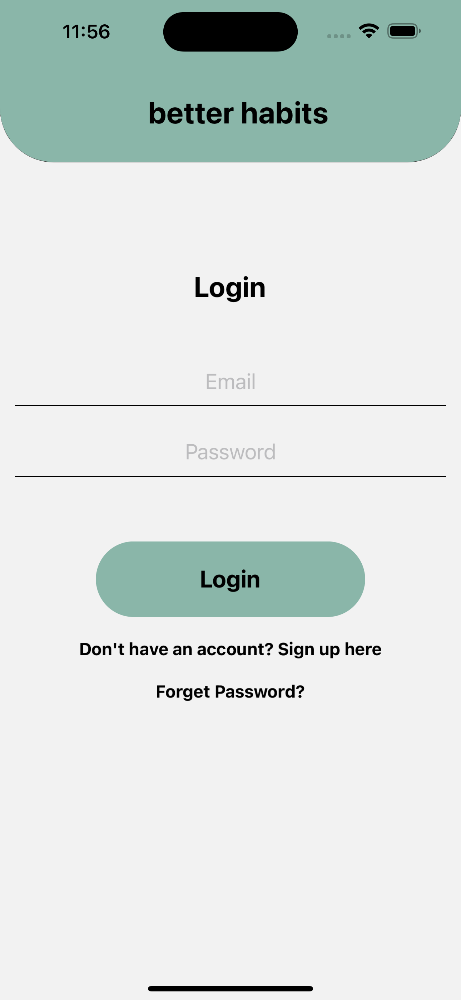

Habit Tracker

Welcome to Habit Tracker, a simple and easy-to-use app for tracking and improving your daily habits. With Habit Tracker, you can:

Keep track of your habits and mark them as complete when you've done them
View your habit statistics, including the total number of habits completed and the percentage of habits completed
View a graph of your habit completion percentage over time
To get started, simply sign in with your email and password or create a new account. Then, add your habits and start marking them as complete as you go about your day. You can view your habit statistics at any time to see how you're doing and track your progress.

## Screenshots

  
  
  

  
  

